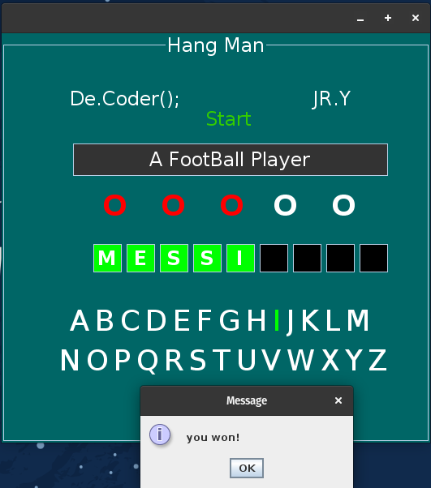

# Hang-Man-Game

My 4th project was in the "Advance Programming" course at spring 2016 when I was in the 2nd semester of my bachelor's at IAUSTB. This is version of the classic letter guessing game called Hangman. You are shown a set of blank letters that match a word or phrase and you have to guess what these letters are to reveal the hidden word. You guess by picking letters from those displayed on the sides. If you pick a letter that is in the word, a sound is played and that letter is revealed from the blank letters; however, if you pick a letter that is not in the word, then a stickman is slowly drawn. With each wrong letter guess, the man is drawn more and more. When the man is finished, he is hung and the game is lost. This is why the game is called 'Hangman'. If you can reveal all the letters in the word before the man is hung then you are successful and the full word is revealed along with an image showing the meaning of the word.

|  | 
|:--:| 
| *output* |
